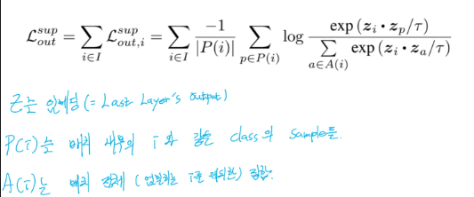

# Supervised Contrastive Learning 리뷰

### 선 3줄 요약

1. 샘플의 배치를 구성할때, 두 덩어리씩 준비하고(=같은 샘플에 증강을 다르게), CNN 에 통과시킨다.
2. 마지막 레이어(=MLP 마지막 레이어)의 임베딩을 얻어서, 배치 내부에 같은 클래스끼리는 내적해서 분자로 , 배치내 모든 임베딩들의 내적 합을 분모로 구성한 로스로 학습을 한다.
3. Inference 시에는 MLP 부분만 C.E 로 새로 훈련시킨 후 사용한다.

### 핵심 아이디어,

Contrastive Learning 을 하는데에 **‘가장 핵심은 Anchor 를 어떻게 잡냐’** 이다.

Supervised Learning 의 경우 학습에 가장 강력한 정보가 주어진다. 바로 Label.

간단하다. **Label 로 Anchor 로 잡고**, 메니폴드에서 같은 Label 이면 가깝게, 다른 Label 이면 멀어지도록 로스를 준다.

### 수식

실제 수식을 보면 바로 위 명시한 핵심 아이디어가 녹아있다. exp 와 log 등의 스케일링 , 미분을 위한 요소들을 제외하면 이해가 쉽다.

CNN 을 통과해서 만들어진 z 임베딩(=정확히는 Convolution 을 거쳐 얻은 Feature 들을 128 차원으로 Projection 시킨 텐서)들 끼리의 내적으로 유사도를 보겠다는 이야기이다. 같은 Class 이면 내적값이 커지도록(분자 주목) 다른 클래스이면 멀어지도록(분모 주목) 학습하는게 SupCon 로스의 의미.

### 궁금점과 고찰.

—  논문에서는 해당 로스로 Encoder 만을 학습시키고, Projection Layer 를 버린다( 실제로 discard 라는 표현 사용)

Inference 를 위해서 C.E 로 새로 MLP 분류기를 학습시키는데 이러한 2-Stage 방식을 채택하는 이유와 해당 방식으로 얻는 이점이 궁금했다.

정답은 간단했다. 결국 우리의 목적은 ‘Image Classification’ 이기 때문이다.

SupCon 으로 학습시킨 MLP 는 임베딩 공간에서 군집화 하기 쉽도록만 해줄 뿐이다.

우리의 원래 목적은 SoftMax(Logit) 의 결과가 1 , 0 이 되도록 Logit 간의 격차가 크도록 결과를 뱉는 MLP 를 만드는 것이기 때문이다.

— 분모에 Negative sample 들로만 구성해야 ‘Negative Sample 들이 멀어지는 것’ 아닌가?

질문 자체에 대한 답은 ‘맞다’ 하지만, 매 배치마다 Negative Sample 들의 갯수가 고정적이지는 않다. 즉 분모 수식에 있는 |A(i)| 가 달라진다.  당연히 학습 안정성이 떨어질 것. (좀 더 쉽게 말하면 로스 값이 매 step 마다 확확 달라질 가능성이 있다.)
